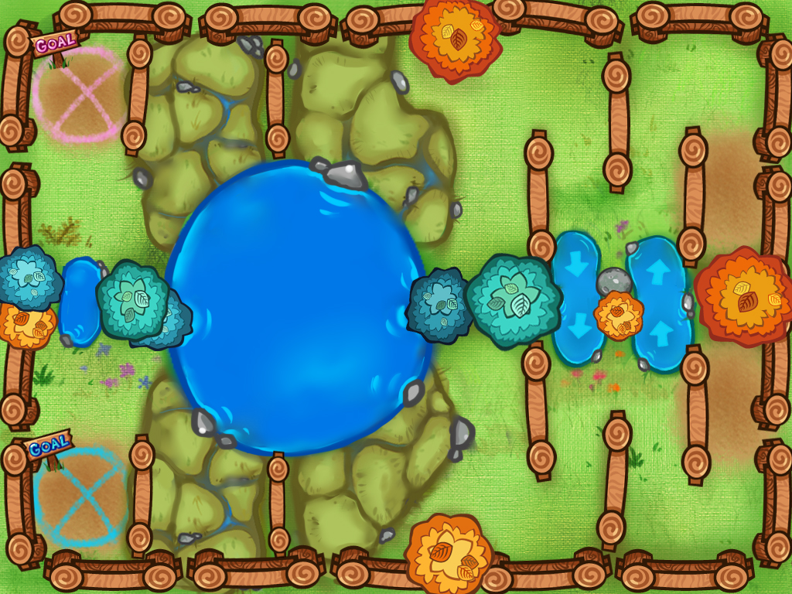
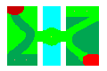
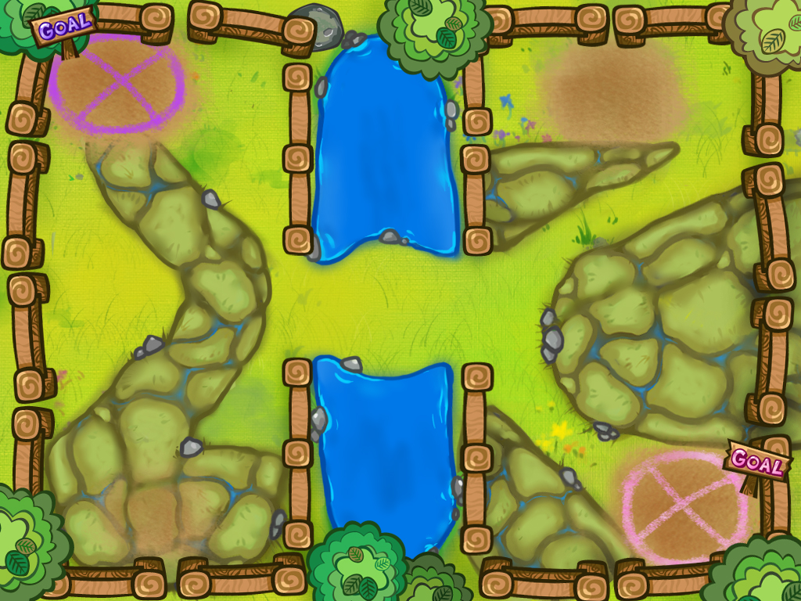
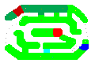
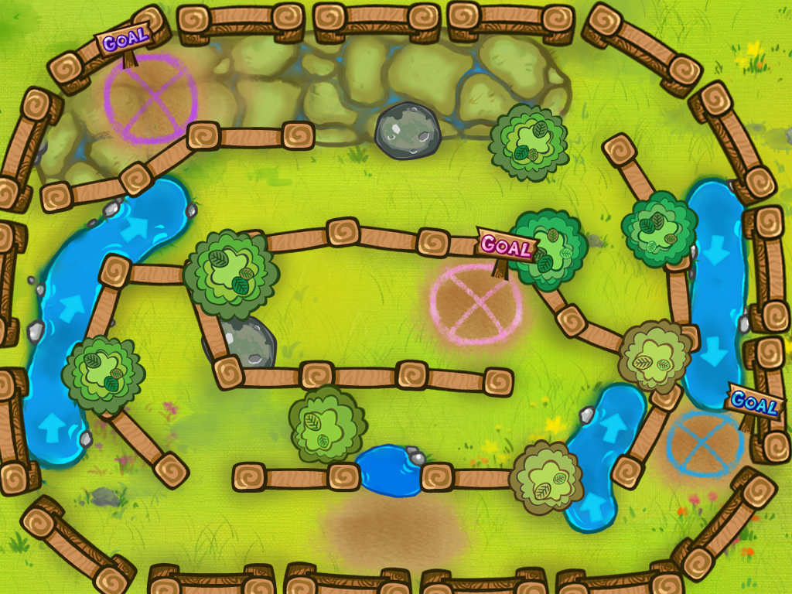

# 跑跑羊的部分原始碼

這是2012年左右的程式，註解很少  
示範了如何協同使用obj-c和c++\(.mm\)，雖然現在這個技術過時了(?)

## 遊戲影片
1. [影片1](https://www.youtube.com/watch?v=KLzvoD4S6f0&list=FLCh6kSSzrx8JKpmFWtso2tw&index=11)
2. [影片2](https://www.youtube.com/watch?v=HEn1MyIF-o0&list=FLCh6kSSzrx8JKpmFWtso2tw&index=18)

## 程式碼部分

注意，程式中幾乎使用靜態配置，就是說將記憶體配在Stack而不是在Heap，我認為這是寫c++的藝術所在  
沒有gc的c++寫動態配置只是自找麻煩  

遊戲中有使用到反向關節-[演算法在此](gameworks/com.gameworks.seqment.mm)  

當時多此一舉，自己還寫了2D Shader-請參考[image shader](gameworks/com.gameworks.opengl.shader.image.mm), [SheepView.mm](modelview/SheepView.mm)

## 使用像素編輯遊戲場景內容

這樣做才可以讓企劃/關卡設計師參與  
Parser在這[GameManager::loadResource](modelview/SheepManager.mm)  

使用這張圖來建立遊戲物件和地形  
  
再蓋上這張假圖。感謝當時美術的工匠精神(36精緻的圖片全部手工)  
  
以下是其它的範例  

  

